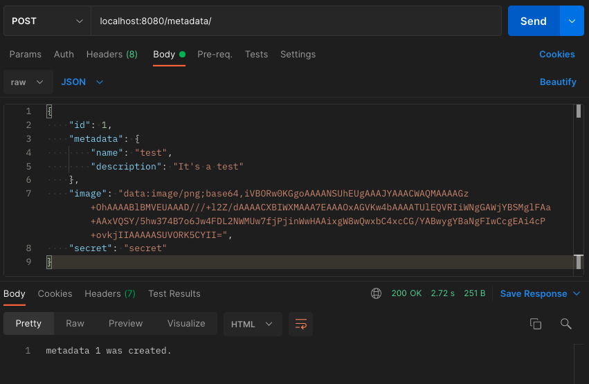
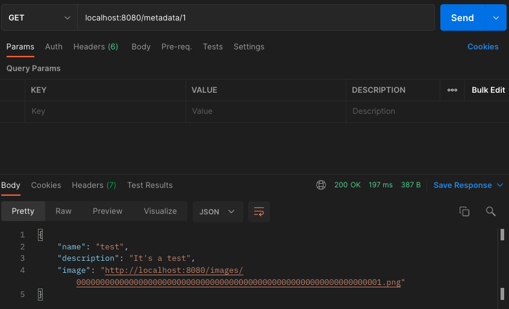
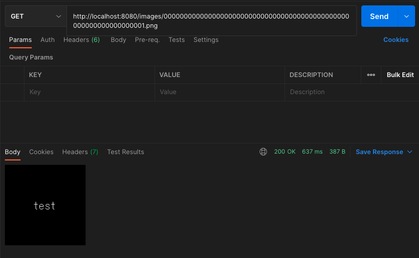

# Centralized NFT metadata API with Firebase
- Based on Express and Firebase
- Feature
  - Create metadata in Firestore Database
  - Store image files in Firebase Storage
  - Fetch metadata and images

## setup

- Create a Firebase project
- Create "metadata" collection in Firestore Database
- Generate a private key file for your service account
  - In the Firebase console, open Settings > Service Accounts.
  - Click Generate New Private Key, then confirm by clicking Generate Key.
  - Put the JSON file to project root and rename it to `serviceAccountKey.json`.
- Create `.env` file

```
STORAGE_BUCKET=<YOUR_FIREBASE_PROJECT_NAME>.appspot.com
SERVER_URL=<SERVER_URL>
SECRET=<YOUR_SECRET>
```

For example,
```
STORAGE_BUCKET=nft-sample.appspot.com
SERVER_URL=http://localhost:8080
SECRET=secret
```

## run

```
yarn install
yarn start
```

## usage
### Create metadata

- ** This secret authorization is not so secure. Update by yourself for production. **  
- "image" must be a base64 format

### Fetch metadata


### Fetch image

